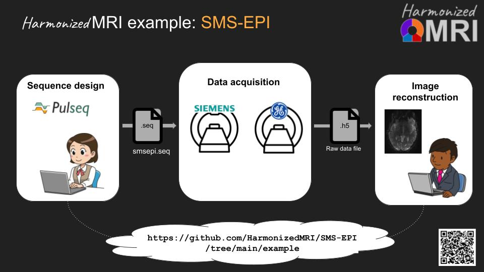

# Harmonized functional MRI with Pulseq

Pooling functional MRI data from different sites and points in time 
should allow for increased statistical power, 
provided that the imaging experiment can be conducted in a known and reproducible way. 
Unfortunately, this has so far proven difficult, 
since the details of the vendor-provided fMRI acquisition and reconstruction software 
are generally not known to the researcher.

We have developed a fully **vendor-agnostic and portable fMRI protocol**
that ensures identical sequence execution and image reconstruction across different scanners, 
and across scanner software upgrades. 
The acquisition sequence is defined in a simple (and human readable) text file in the 
[Pulseq](https://pulseq.github.io/)
file format, 
and sequence execution on real hardware is made possible with sequence-agnostic interpreters that we provide.
This ensures transparent and optimally reproducible experimental conditions across sites.
**Our protocol is fully open-source and available to the broader research community**,
and we hope that it will become the new standard for future multi-site functional MRI studies.

So far, our protocol has been tested Siemens and GE scanners, but other vendors are adding (or have already added)
Pulseq support and we encourage you to reach out to your vendor representative for the latest information.
See also the session 
[Open Innovation in MR from Vendor & Academia Perspective](https://submissions.mirasmart.com/ISMRM2025/Itinerary/ConferenceMatrixEventDetail.aspx?ses=MIS-01)
at ISMRM 2025.

**We want to hear from you!**
Please take a moment to fill out
[this form](https://docs.google.com/forms/d/e/1FAIpQLSeqZ1c43RXhGUqAE8bWypmY2fRfSjww0_xki_Qv89HJqhZ2qA/viewform)
to let us know about your needs and interests.

To learn more, check out our talk at the ISMRM Reproducible Research Study Group Virtual Meeting:
Funding for Open Science in MRI, 
16 June 2025.
[Slide deck.](https://docs.google.com/presentation/d/1wXAz0ms4QiGtGIa4HfnuZJABRX5qAtt1GV0blcvtPFQ/edit?usp=sharing)

## Getting started

### For PIs preparing an NIH grant application:
We encourage you to write Pulseq fMRI into your next grant application!
We believe that Pulseq is the best technology for achieving transparent and reproducible MRI, 
and that grant reviewers will agree.
At [this link](https://drive.google.com/drive/folders/1SaivtmjwFJ_OsU8SBrE1ub1DmhPF6p6W?usp=sharing)
you will find **NIH grant text templates** to help you get started.
There you will also find **IRB application example text** that you may find useful
when applying for local IRB approval for a study that uses Pulseq MRI protocols.

### For pulse sequence developers/maintainers:
If you want to test the acquisition and/or reconstruction protocol:

1. Contact the HarmonizedMRI study team for access to the interpreter for your scanner.

2. Ask the study team for the sequence file 'smsepi.seq', 
or create your own using the 'writeEPI.m' MATLAB function that we provide.
The run it on your scanner.

3. Reconstruct the data using slice GRAPPA code that we provide.

For more information, see the ./example/ folder in the 
[SMS-EPI](https://github.com/HarmonizedMRI/SMS-EPI)
Github repository.

## Contact us

If you'd like to give our Pulseq fMRI protocol a quick try for evaluation purposes, 
or are already sure you want to use it for your fMRI studies, 
[contact us by email](mailto:jfnielse@umich.edu) and we will work with you
to install the Pulseq interpreters and the sequence and reconstruction code.  
At present, we ask that if you plan to use our Pulseq protocol in your fMRI studies, 
your scanner is also equipped with the corresponding SMS-EPI product sequence.

