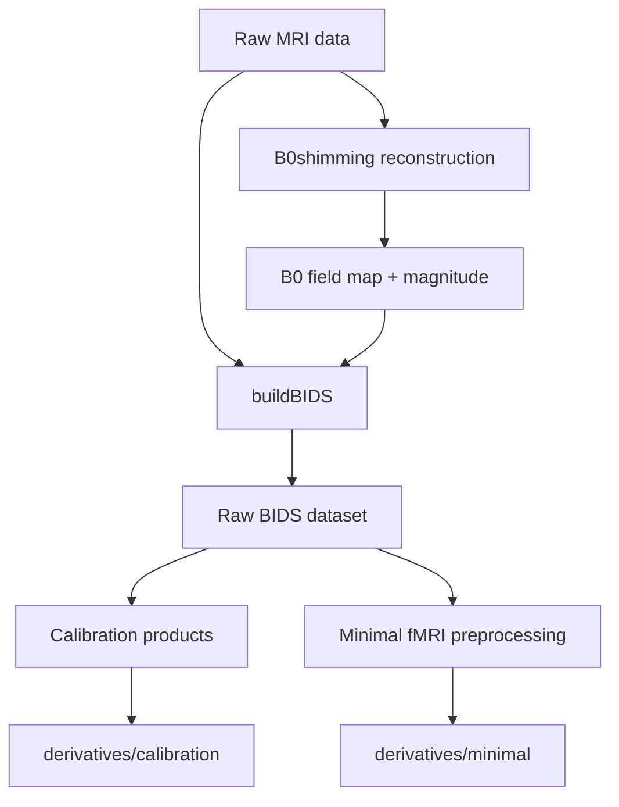

# Data processing

This directory contains tools for organizing and minimally preprocessing the HarmonizedMRI functional imaging data.

## Overall workflow



The processing is divided across the `HarmonizedMRI/B0shimming` and `HarmonizedMRI/Functional` repositories.

## 1. B0 field-map reconstruction

B0 field maps are reconstructed using the `HarmonizedMRI/B0shimming` repository.

The reconstruction produces the field map and magnitude image used for distortion correction of the fMRI data. These images are subsequently incorporated into the raw BIDS dataset by `buildBIDS`.

Although the field map is reconstructed from the acquired data, the B0 field map and magnitude image are inputs to fMRI preprocessing and therefore live in the raw BIDS `fmap/` directory rather than under `derivatives/`.

## 2. Create the BIDS dataset

The [`buildBIDS/`](buildBIDS/) tools collect the anatomical, field-map, and functional images and organize them into a BIDS dataset.

A typical destination is:

```text
${HOME}/bidsRoot/
```

For example:

```text
bidsRoot/
├── dataset_description.json
└── sub-00007/
    └── ses-umichmr75020241124/
        ├── anat/
        │   └── sub-00007_ses-umichmr75020241124_T1w.nii.gz
        ├── fmap/
        │   ├── sub-00007_ses-umichmr75020241124_fieldmap.nii.gz
        │   └── sub-00007_ses-umichmr75020241124_magnitude.nii.gz
        └── func/
            ├── ..._task-vismotor_acq-product_run-01_bold.nii
            └── ..._task-vismotor_acq-pulseq_run-01_bold.nii
```

The corresponding JSON sidecars are also created.

See [`buildBIDS/README.md`](buildBIDS/README.md) for details.

## 3. Calibration derivatives

Derived calibration products are stored separately from the raw BIDS images under:

```text
${HOME}/bidsRoot/derivatives/calibration/
```

These may include sensitivity maps and other derived calibration or reconstruction products used by downstream processing.

The distinction is:

- acquired or reconstructed images that serve as BIDS preprocessing inputs, such as the B0 field map and magnitude image, remain in the raw BIDS dataset;
- derived calibration products, such as sensitivity maps, are stored under `derivatives/calibration/`.

A typical organization is:

```text
bidsRoot/
└── derivatives/
    └── calibration/
        ├── dataset_description.json
        └── sub-00007/
            └── ses-umichmr75020241124/
                └── ...
```

## 4. Minimal fMRI preprocessing

The [`minimal/`](minimal/) pipeline reads the BIDS dataset produced by `buildBIDS` and performs:

1. B0 distortion correction
2. Rigid-body motion correction
3. EPI-to-T1w registration
4. Optional T1w-to-MNI152NLin2009cAsym registration

The same BIDS root is used as both the input dataset and the parent directory for derivatives:

```bash
BIDS_DIR="${HOME}/bidsRoot"
```

The processed results are written to:

```text
${HOME}/bidsRoot/derivatives/minimal/
```

For example:

```text
bidsRoot/
├── sub-00007/
│   └── ses-umichmr75020241124/
│       ├── anat/
│       ├── fmap/
│       └── func/
│
└── derivatives/
    ├── calibration/
    │   ├── dataset_description.json
    │   └── sub-00007/
    │       └── ses-umichmr75020241124/
    │           └── ...
    │
    └── minimal/
        ├── dataset_description.json
        └── sub-00007/
            └── ses-umichmr75020241124/
                ├── anat/
                ├── fmap/
                ├── func/
                └── qc/
```

The original BIDS data are not modified by the minimal preprocessing pipeline.

See [`minimal/README.md`](minimal/README.md) for details.

## Data sharing

`${HOME}/bidsRoot/` is the common destination for the organized BIDS data and its derivatives:

```text
bidsRoot/
├── <raw BIDS dataset>
└── derivatives/
    ├── calibration/
    └── minimal/
```

This makes `bidsRoot` a convenient unit for data sharing.

For sharing minimally processed data, the relevant processing outputs are under:

```text
bidsRoot/derivatives/minimal/
```

The raw BIDS dataset should also be shared when recipients need the source images or wish to reproduce the preprocessing. Calibration derivatives can be included when they are needed for reconstruction or other downstream analyses.

The scanner raw data and raw k-space data are maintained separately and are not implied by the term "raw BIDS dataset."

## Directory overview

```text
data-processing/
├── buildBIDS/
│   └── Create the raw BIDS image dataset and associated derivatives
│
├── minimal/
│   └── Minimal B0, motion, anatomical, and optional MNI preprocessing
│
└── session/
    └── Locate session configuration and source/raw data
```

B0 field-map reconstruction is maintained separately in the `HarmonizedMRI/B0shimming` repository.
