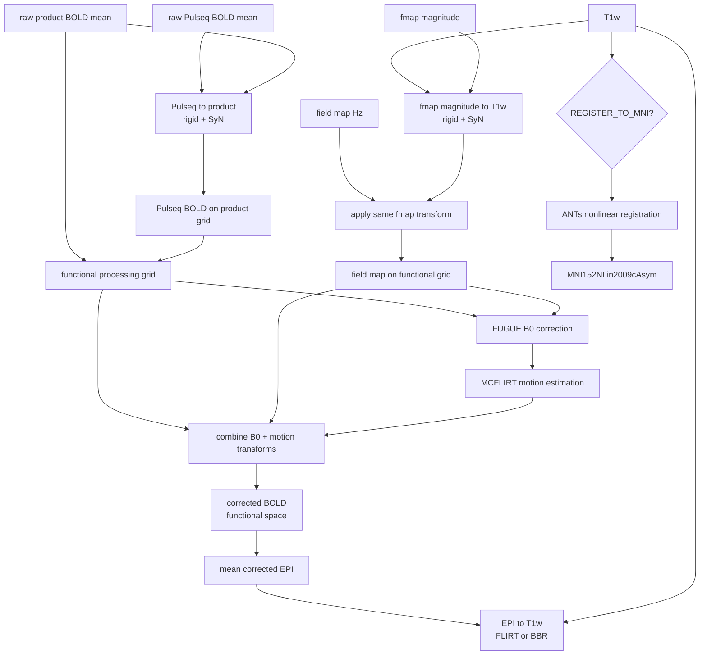

# Minimal fMRI preprocessing pipeline

`run_minimal_fmri_pipeline.sh` implements a lightweight geometric preprocessing pipeline for the harmonized fMRI data.

The pipeline performs:

1. Empirical field-map geometry alignment using ANTs
2. Optional Pulseq-to-product static geometry alignment using ANTs
3. B0 distortion correction using FSL `fugue`
4. Rigid-body motion correction using FSL `mcflirt`
5. Registration of the corrected mean EPI to the T1-weighted image
6. Optional nonlinear T1w → MNI152NLin2009cAsym registration

The final 4D BOLD series remains in functional space. Spatial transforms are retained for QC, overlays, figures, and downstream analyses.

The pipeline intentionally does **not** perform spatial smoothing, slice-timing correction, nuisance regression, temporal filtering, or surface reconstruction.

## Geometry strategy

Two Pulseq-related geometry issues are handled explicitly.

### Field-map geometry

The B0 field map and magnitude image come from a Pulseq acquisition and have not undergone a calibrated gradient-nonlinearity correction.

The pipeline therefore estimates an empirical rigid + SyN transform:

```text
fmap magnitude → T1w
```

using ANTs. A 3 mm T1w image is used only to estimate the transform to reduce registration memory requirements. The resulting transform is then applied to both:

- the field-map magnitude image;
- the Hz field map.

The corrected field map is sampled directly onto the functional processing grid before FUGUE is run.

This nonlinear registration is an empirical geometry correction and should not be interpreted as a calibrated gradient-nonlinearity correction.

### Pulseq BOLD geometry

The Pulseq and product BOLD acquisitions are designed to have very closely matched susceptibility distortion. For Pulseq data, the pipeline therefore estimates the static geometry correction **before B0 correction**:

```text
raw Pulseq mean → raw product mean
```

The shared B0 distortion remains common to the two images, so the transform is intended primarily to capture:

- prescription offset;
- smooth geometric mismatch associated with missing gradient-nonlinearity correction.

The matching product run is used as the fixed reference.

The static Pulseq transform is then applied to the full Pulseq time series before B0 and motion correction.

## Processing workflow



For product BOLD, the Pulseq-to-product branch is skipped.

## Requirements

The pipeline requires:

- FSL
- ANTs
- `jq`
- Python 3
- BIDS-organized input data

Optional MNI normalization additionally requires TemplateFlow.

See [`DEVELOPMENT.md`](DEVELOPMENT.md) for installation and setup notes.

## Expected BIDS input

For example:

```text
bidsRoot/
└── sub-00007/
    └── ses-umichmr75020241124/
        ├── anat/
        │   ├── sub-00007_ses-umichmr75020241124_T1w.nii.gz
        │   └── sub-00007_ses-umichmr75020241124_T1w.json
        ├── fmap/
        │   ├── sub-00007_ses-umichmr75020241124_fieldmap.nii.gz
        │   ├── sub-00007_ses-umichmr75020241124_fieldmap.json
        │   ├── sub-00007_ses-umichmr75020241124_magnitude.nii.gz
        │   └── sub-00007_ses-umichmr75020241124_magnitude.json
        └── func/
            ├── ..._task-vismotor_acq-product_run-01_bold.nii
            ├── ..._task-vismotor_acq-product_run-01_bold.json
            ├── ..._task-vismotor_acq-pulseq_run-01_bold.nii
            └── ..._task-vismotor_acq-pulseq_run-01_bold.json
```

The field map must be expressed in Hz.

The BOLD JSON sidecar must contain:

```json
{
  "PhaseEncodingDirection": "j-",
  "TotalReadoutTime": 0.0522
}
```

The pipeline determines the FUGUE unwarp direction from `PhaseEncodingDirection` and calculates the effective echo spacing from `TotalReadoutTime` and the phase-encoding matrix size.

## Configuration

Edit the user settings near the top of `run_minimal_fmri_pipeline.sh`.

For example:

```bash
SUBJECT="sub-00007"
SESSION="ses-umichmr75020241124"

TASK="vismotor"
ACQ="product"
RUN="01"

BIDS_DIR="${HOME}/bidsRoot"
```

To process Pulseq:

```bash
ACQ="pulseq"
```

### Field-map geometry alignment

```bash
ALIGN_FMAP_TO_T1=true
```

When enabled, the pipeline estimates a rigid + SyN transform from field-map magnitude to T1w and applies the same transform to the Hz field map.

Registration settings are:

```bash
ANTS_THREADS=2
ANTS_PRECISION="f"
REGISTRATION_T1_RESOLUTION_MM=3
```

The lower-resolution T1w image is used only during transform estimation. Final outputs can still be sampled on the original T1w or functional grid.

### Pulseq geometry correction

```bash
CORRECT_PULSEQ_GEOMETRY=true
```

This option is used only for `ACQ="pulseq"`.

The default product reference is the product run with the same run number:

```bash
PRODUCT_REFERENCE_RUN="${RUN}"
```

The registration is estimated on the raw, un-B0-corrected means:

```text
raw Pulseq mean → raw product mean
```

using rigid + SyN.

This ordering is intentional because the product and Pulseq EPI B0 distortions are closely matched by design.

### Field-map sign

```bash
NEGATE_FIELDMAP=false
```

Set to `true` to multiply the field map by -1 before FUGUE if required by the field-map/FUGUE sign convention.

### Combined B0 and motion resampling

```bash
APPLY_COMBINED_TRANSFORMS=true
```

This is the recommended mode.

Motion is estimated from provisionally B0-corrected data, but the B0 and volume-specific motion transforms are combined before generating the retained BOLD series.

For product data, B0 and motion correction therefore require one final interpolation.

For Pulseq data, the current implementation first applies the static ANTs Pulseq geometry correction, followed by one combined B0+motion interpolation. Thus Pulseq data currently undergo two interpolations.

### EPI-to-T1w registration

```bash
USE_BBR=false
```

The default uses six-degree-of-freedom FLIRT registration with normalized mutual information.

Set:

```bash
USE_BBR=true
```

to use boundary-based registration with BET, FAST, and `epi_reg`.

### MNI normalization

```bash
REGISTER_TO_MNI=true
```

When enabled, the T1w image is nonlinearly registered to:

```text
MNI152NLin2009cAsym
```

using ANTs and TemplateFlow.

The pipeline saves the forward and inverse transforms and an MNI-space T1w image.

The full 4D BOLD series is **not** automatically resampled into MNI space.

## Run

```bash
chmod +x run_minimal_fmri_pipeline.sh
./run_minimal_fmri_pipeline.sh
```

## Output

Public-facing outputs are written under:

```text
bidsRoot/
└── derivatives/
    └── minimal/
        ├── dataset_description.json
        └── sub-00007/
            └── ses-umichmr75020241124/
                ├── func/
                ├── fmap/
                ├── anat/
                └── qc/
```

### `func/`

Contains the final B0- and motion-corrected BOLD series:

```text
*_desc-b0corrMc_bold.nii.gz
```

For Pulseq processing it also contains the saved Pulseq↔product geometry transforms.

### `fmap/`

Contains:

- field-map magnitude resampled into functional space;
- Hz field map resampled into functional space;
- voxel-shift map;
- fmap↔T1w geometry transforms.

### `anat/`

Contains:

- functional→T1w transform;
- optional T1w↔MNI transforms;
- optional MNI-space T1w image.

### `qc/`

Contains:

- raw mean EPI;
- Pulseq geometry-corrected mean EPI, when applicable;
- B0-corrected mean EPI;
- field-map magnitude in T1w space;
- motion parameters and RMS motion estimates.

## Quality control

### Field-map geometry

Inspect the ANTs magnitude→T1w registration:

```bash
fsleyes \
    <T1w> \
    <fmap-magnitude-in-T1w-space>
```

The warped magnitude should align anatomically with the T1w image.

### Pulseq geometry

For Pulseq runs, compare the matching raw product mean with the Pulseq mean after static geometry correction:

```bash
fsleyes \
    <raw-product-mean> \
    <pulseq-geometry-corrected-mean>
```

This QC should be performed before interpreting B0 correction.

### B0 correction

Overlay the field-map magnitude in functional space with the functional mean before and after FUGUE:

```bash
fsleyes \
    <magnitude-in-functional-space> \
    <functional-mean-before-B0> \
    <B0-corrected-mean-EPI>
```

For Pulseq, `<functional-mean-before-B0>` should be the geometry-corrected Pulseq mean rather than the original raw mean.

### EPI-to-T1w registration

```bash
fsleyes \
    <T1w> \
    <mean-EPI-in-T1w-space>
```

### MNI registration

When enabled:

```bash
fsleyes \
    <MNI152NLin2009cAsym-template> \
    <T1w-in-MNI-space>
```

## Important limitations

The nonlinear magnitude→T1w and Pulseq→product registrations are empirical geometry corrections. They can compensate smooth geometric mismatch from uncorrected gradient nonlinearity and prescription offsets, but they are not equivalent to a scanner-calibrated gradient-nonlinearity correction.

The Pulseq→product nonlinear registration assumes that the product and Pulseq EPI acquisitions have closely matched susceptibility distortion. This is a design assumption of the harmonized acquisition and should be reconsidered if acquisition parameters differ.

## Relationship to fMRIPrep

This pipeline is intentionally more limited and more explicit than fMRIPrep. It is intended as a transparent minimal geometric preprocessing workflow for the harmonized fMRI data.

See [`DEVELOPMENT.md`](DEVELOPMENT.md) for installation, testing, and comparison notes.
