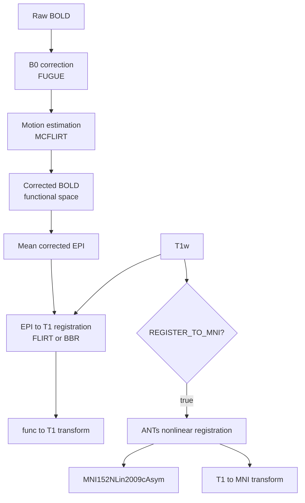

# Minimal fMRI preprocessing pipeline

`run_minimal_fmri_pipeline.sh` implements a lightweight fMRI preprocessing
pipeline intended primarily for processing and comparing the harmonized
Pulseq and product fMRI acquisitions.

The pipeline performs:

1. B0 distortion correction using FSL `fugue`
2. Rigid-body motion correction using FSL `mcflirt`
3. Registration of the mean corrected EPI to the T1-weighted image
4. Optional nonlinear T1w → MNI152NLin2009cAsym registration using ANTs

The final 4D BOLD series remains in native functional space. Transformations
to T1w and MNI space are estimated and retained for overlays, figures, and
downstream analyses.

The pipeline intentionally does not perform spatial smoothing, slice-timing
correction, nuisance regression, temporal filtering, or surface
reconstruction.

## Processing workflow



## Requirements

The basic pipeline requires:

- FSL
- `jq`
- Python 3
- BIDS-organized input data

Optional MNI normalization additionally requires:

- ANTs
- TemplateFlow

## Install FSL

For example:

```bash
curl -Ls https://fsl.fmrib.ox.ac.uk/fsldownloads/fslinstaller.py \
    -o fslinstaller.py

python3 fslinstaller.py
```

If FSL is installed in `${HOME}/fsl`, add to `.bashrc`:

```bash
export FSLDIR="${HOME}/fsl"
. "${FSLDIR}/etc/fslconf/fsl.sh"
export PATH="${FSLDIR}/share/fsl/bin:$PATH"
```

Then reload the shell:

```bash
source ~/.bashrc
```

Check:

```bash
command -v fugue
command -v mcflirt
command -v flirt
```

## Install ANTs

ANTs is required only when:

```bash
REGISTER_TO_MNI=true
```

Download a precompiled Linux release of ANTs from the ANTs GitHub releases
page and extract it to a convenient location, for example:

```text
${HOME}/ants/
```

Add the ANTs `bin` directory to your `PATH`. For example:

```bash
export ANTSDIR="${HOME}/ants/ants-2.x.x"
export PATH="${ANTSDIR}/bin:$PATH"
```

Add these lines to `.bashrc` if you want ANTs available in future shells.

Check the installation:

```bash
command -v antsRegistrationSyN.sh
command -v antsApplyTransforms
```

Both commands should return paths to the corresponding ANTs executables.

## Install TemplateFlow

TemplateFlow is used to obtain the canonical
`MNI152NLin2009cAsym` template.

Install with:

```bash
python3 -m pip install templateflow
```

Check:

```bash
python3 -c "import templateflow.api; print('TemplateFlow OK')"
```

TemplateFlow does not need to be installed in a dedicated Python environment
as long as it is accessible to the `python3` command used when the pipeline
is run.

## Expected BIDS input

For example:

```text
bidsRoot/
└── sub-00007/
    └── ses-umichmr75020241124/
        ├── anat/
        │   ├── sub-00007_ses-umichmr75020241124_T1w.nii.gz
        │   └── sub-00007_ses-umichmr75020241124_T1w.json
        ├── fmap/
        │   ├── sub-00007_ses-umichmr75020241124_fieldmap.nii.gz
        │   ├── sub-00007_ses-umichmr75020241124_fieldmap.json
        │   ├── sub-00007_ses-umichmr75020241124_magnitude.nii.gz
        │   └── sub-00007_ses-umichmr75020241124_magnitude.json
        └── func/
            ├── sub-00007_ses-umichmr75020241124_task-vismotor_acq-product_run-01_bold.nii
            └── sub-00007_ses-umichmr75020241124_task-vismotor_acq-product_run-01_bold.json
```

The field map must be expressed in Hz.

The BOLD JSON sidecar must contain:

```json
{
  "PhaseEncodingDirection": "j-",
  "TotalReadoutTime": 0.0522
}
```

The pipeline determines the FUGUE unwarp direction from
`PhaseEncodingDirection` and calculates the effective echo spacing from
`TotalReadoutTime` and the phase-encoding matrix size.

## Configuration

Edit the user settings near the top of `run_minimal_fmri_pipeline.sh`.

For example:

```bash
SUBJECT="sub-00007"
SESSION="ses-umichmr75020241124"

TASK="vismotor"
ACQ="product"
RUN="01"

BIDS_DIR="${HOME}/bidsRoot"
```

To process a Pulseq acquisition instead:

```bash
ACQ="pulseq"
```

To select another run:

```bash
RUN="02"
```

### Field-map sign

```bash
NEGATE_FIELDMAP=false
```

Set to `true` to multiply the field map by -1 before distortion correction.
This is primarily useful for testing field-map sign conventions.

### EPI-to-T1 registration

```bash
USE_BBR=false
```

The default uses six-degree-of-freedom FLIRT registration with normalized
mutual information.

Set:

```bash
USE_BBR=true
```

to use boundary-based registration (BBR) with BET, FAST, and `epi_reg`.

### Combined B0 and motion resampling

```bash
APPLY_COMBINED_TRANSFORMS=true
```

This is the recommended mode.

Motion is estimated from provisionally B0-corrected data, but the B0 and
volume-specific motion transformations are combined before generating the
final BOLD series. Each original BOLD volume is therefore interpolated only
once.

Set:

```bash
APPLY_COMBINED_TRANSFORMS=false
```

to use the simpler sequential workflow:

```text
Raw BOLD → FUGUE → MCFLIRT
```

### MNI normalization

MNI normalization is optional:

```bash
REGISTER_TO_MNI=false
```

Set:

```bash
REGISTER_TO_MNI=true
```

to perform nonlinear T1w registration to:

```text
MNI152NLin2009cAsym
```

using ANTs.

The pipeline saves the T1w→MNI and MNI→T1w transforms and an MNI-space T1w
image.

The full 4D BOLD series is **not** automatically resampled into MNI space.
Instead, the pipeline retains:

```text
functional → T1w
T1w → MNI152NLin2009cAsym
```

transformations for later use. This allows functional derivatives such as
activation maps to be transformed to MNI space with a single final
resampling.

## Run

Make the script executable:

```bash
chmod +x run_minimal_fmri_pipeline.sh
```

Then run:

```bash
./run_minimal_fmri_pipeline.sh
```

## Output

Public-facing outputs are written as a BIDS derivatives dataset:

```text
bidsRoot/
└── derivatives/
    └── minimal/
        ├── dataset_description.json
        └── sub-00007/
            └── ses-umichmr75020241124/
                ├── func/
                ├── fmap/
                ├── anat/
                └── qc/
```

### `func/`

Contains the final B0- and motion-corrected BOLD series and mean EPI
registration products.

The principal output is:

```text
*_desc-b0corrMc_bold.nii.gz
```

### `fmap/`

Contains field-map-related derivatives in functional space, including the
resampled field map, magnitude image, and voxel-shift map.

### `anat/`

Contains spatial transformations, including the functional→T1w transform.

When:

```bash
REGISTER_TO_MNI=true
```

this directory additionally contains:

```text
*_from-T1w_to-MNI152NLin2009cAsym_mode-image_xfm.h5
*_from-MNI152NLin2009cAsym_to-T1w_mode-image_xfm.h5
*_space-MNI152NLin2009cAsym_desc-preproc_T1w.nii.gz
```

### `qc/`

Contains intermediate mean images and motion parameters useful for quality
control.

## Quality control

### B0 correction

Overlay the raw and corrected mean EPI on the field-map magnitude image:

```bash
fsleyes \
    <magnitude-in-functional-space> \
    <raw-mean-EPI> \
    <B0-corrected-mean-EPI>
```

### EPI-to-T1 registration

```bash
fsleyes \
    <T1w> \
    <mean-EPI-in-T1w-space>
```

### MNI registration

When MNI normalization is enabled:

```bash
fsleyes \
    <MNI152NLin2009cAsym-template> \
    <T1w-in-MNI-space>
```

Inspect the overall brain outline, cortical boundaries, ventricles,
cerebellum, and inferior brain regions.

## Relationship to fMRIPrep

This pipeline is intentionally much more limited than fMRIPrep. It is
designed as a transparent minimal preprocessing workflow for the harmonized
fMRI data rather than as a replacement for a full fMRI preprocessing
pipeline.

The repository also includes:

```bash
./run_fmriprep.sh
```

for comparison with fMRIPrep processing.

See `DEVELOPMENT.md` for installation/testing notes, individual-stage
validation scripts, BIDS validation, and the fMRIPrep comparison workflow.
